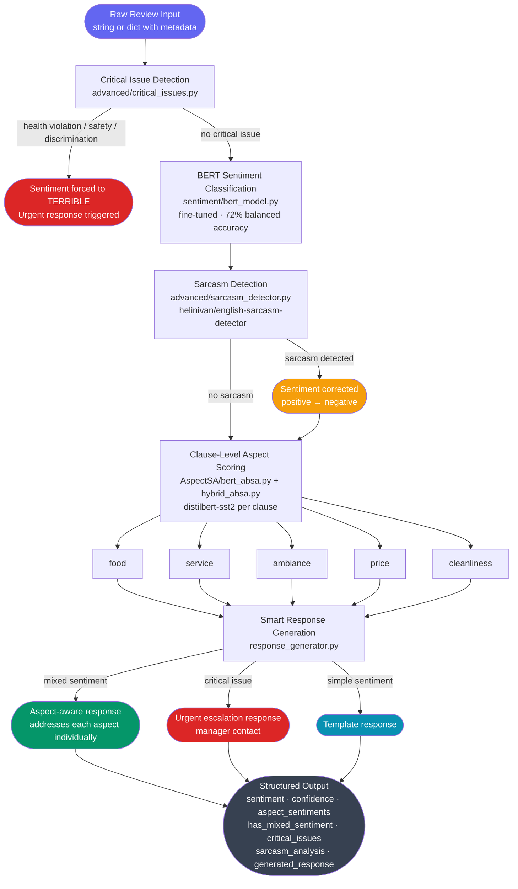
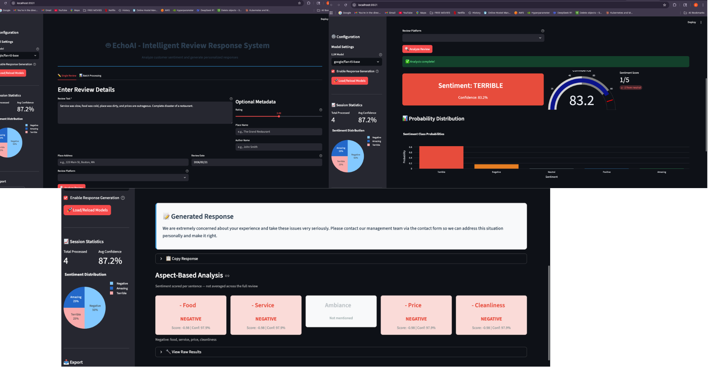
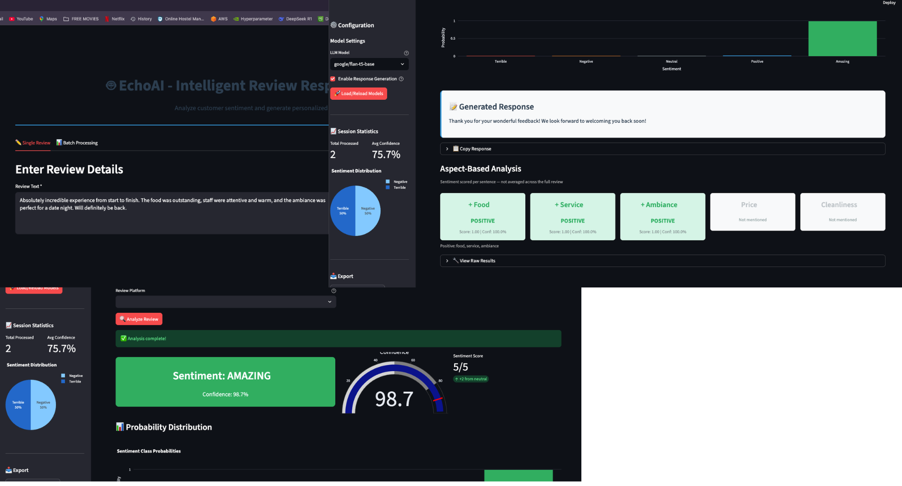
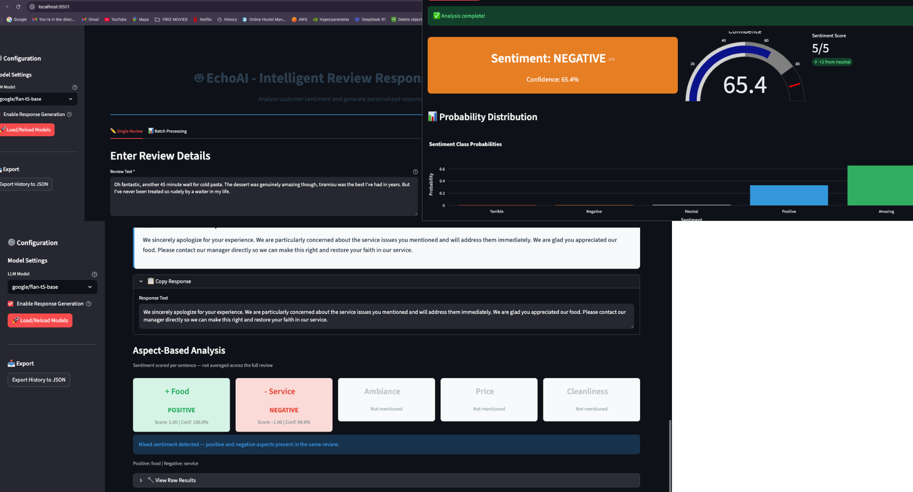

 # EchoAI — Intelligent Restaurant Review Response System

Automated pipeline that analyzes customer reviews and generates context-aware business responses. Handles sarcasm, mixed sentiment, health violations, and aspect-level feedback using a multi-stage NLP architecture.

**Live Demo:** [link coming soon]

---

## Problem

Restaurants receive hundreds of reviews daily across Google, Yelp, and TripAdvisor. Responding to all of them manually is not scalable, but generic auto-responses damage customer trust. EchoAI generates responses that read like a human wrote them — addressing specific complaints, acknowledging what worked, and escalating health or safety issues to management automatically.

---

## Pipeline Architecture



---

## Example Output

### Screenshots





<details>
<summary>View raw JSON output</summary>
```json
[
  {
    "timestamp": "2026-02-21 22:06:10",
    "review": "Service was slow, food was cold, place was dirty, and prices are outrageous. Complete disaster of a restaurant.",
    "sentiment": "terrible",
    "confidence": 0.832,
    "response": "We are extremely concerned about your experience and take these issues very seriously. Please contact our management team via the contact form so we can address this situation personally and make it right."
  },
  {
    "timestamp": "2026-02-21 22:03:29",
    "review": "Found a hair in my salad. Otherwise the food was decent and the place looked clean enough.",
    "sentiment": "terrible",
    "confidence": 0.859,
    "response": "We are extremely concerned about your experience and take these issues very seriously. The health and safety matter you mentioned is unacceptable and requires immediate investigation. Please contact our management team via the contact form so we can address this situation personally and make it right."
  },
  {
    "timestamp": "2026-02-21 21:39:55",
    "review": "Oh fantastic, another 45 minute wait for cold pasta. The dessert was genuinely amazing though, tiramisu was the best I've had in years. But I've never been treated so rudely by a waiter in my life.",
    "sentiment": "negative",
    "confidence": 0.654,
    "response": "We sincerely apologize for your experience. We are particularly concerned about the service issues you mentioned and will address them immediately. We are glad you appreciated our food. Please contact our manager directly so we can make this right and restore your faith in our service."
  }
]
```

</details>

---

## Tech Stack

| Layer | Technology |
|---|---|
| Overall Sentiment | Fine-tuned BERT (`bert-base-uncased`) |
| Aspect Scoring | DistilBERT SST-2 (`distilbert-base-uncased-finetuned-sst-2-english`) |
| Sarcasm Detection | `helinivan/english-sarcasm-detector` |
| Clause Splitting | spaCy `en_core_web_sm` |
| UI | Streamlit |
| CI/CD | GitHub Actions |
| Container | Docker |
| Cloud | GCP Cloud Run |
| Model Registry | GCS |
| Experiment Tracking | MLflow |

---

## Performance

| Metric | Value |
|---|---|
| BERT balanced accuracy | 72% |
| Edge case test suite | 9/10 |
| Aspects tracked | 5 (food, service, ambiance, price, cleanliness) |
| Sentiment classes | 5 (terrible, negative, neutral, positive, amazing) |

---

## Project Structure

```
echo-ai/
├── model_pipeline/
│   ├── enhanced_inference_pipeline.py  # Main pipeline entry point
│   ├── response_generator.py           # Aspect-aware response templates
│   ├── config.py                       # Centralized path config
│   ├── finaletester.py                 # Edge case test suite
│   ├── AspectSA/
│   │   ├── bert_absa.py                # Clause-level aspect scoring
│   │   └── hybrid_absa.py              # Rule-based + BERT hybrid
│   ├── advanced/
│   │   ├── sarcasm_detector.py         # Sarcasm detection + correction
│   │   └── critical_issues.py          # Health/safety issue detection
│   ├── sentiment/
│   │   └── bert_model.py               # Fine-tuned BERT classifier
│   └── models/                         # Trained model artifacts (GCS)
├── Data-Pipeline/
│   └── scripts/                        # Preprocessing, feature engineering, validation
├── app.py                              # Streamlit UI
├── Dockerfile                          # Cloud Run container
├── requirements-streamlit.txt
└── .github/workflows/
    ├── ml_train.yml                    # Training + validation + bias detection
    └── deploy_cloudrun.yml             # Streamlit deployment
```

---

## Local Setup

```bash
git clone https://github.com/YOUR_USERNAME/echo-ai.git
cd echo-ai
pip install -r requirements-streamlit.txt
python -m spacy download en_core_web_sm
```

Run the Streamlit app:

```bash
streamlit run app.py
```

Run the edge case test suite:

```bash
cd model_pipeline
python finaletester.py
```

---

## MLOps Pipeline

The GitHub Actions workflow runs on every push to `model_pipeline/` or `Data-Pipeline/`:

1. **Data preprocessing** — merges scraped CSVs, deduplicates, engineers features
2. **Model training** — trains classifiers, tracks experiments with MLflow
3. **Validation** — enforces minimum F1 threshold of 0.60
4. **Enhanced inference** — runs `EnhancedInferencePipeline` on 100 reviews, outputs aspect breakdown
5. **Bias detection** — checks fairness across rating slices
6. **Model registry** — packages and uploads versioned artifacts to GCS

---

## Key Engineering Decisions

**Why critical issue detection runs first** — a review containing a health violation should always generate an urgent response regardless of overall sentiment. Running BERT first would allow a review like "Found a hair in my salad, otherwise the food was decent" to be classified as neutral and receive a generic thank-you response.

**Why aspect scoring is clause-level, not full-review** — "Best pizza I've ever had but the waiter was incredibly rude" scores food as negative if scored against the full text. Splitting on contrast conjunctions (but, however, although) before scoring isolates each clause to its relevant aspect.

**Why sarcasm detection sits between BERT and ABSA** — BERT misclassifies obvious sarcasm like "Oh great, cold food again" as positive. Correcting sentiment before aspect scoring prevents the wrong polarity from propagating into the response generator.